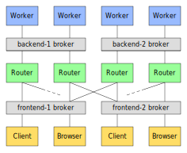

## Chat example

This example implements a real world setup with isolated buses and redundancy:




## Running this example

To run this example start worker pools:
```
cd beekeper/examples/chat
source setup.sh
./run.sh
```
Then open `chat.html` in a browser, or use the command line client:

```
./chat.pl
```
When done, stop worker pools with:
```
./run.sh stop
```
Network traffic can be inspected with:
```
tcpflow -i any -C -g port 61613
```

---
## RabbitMQ setup

In order to run this example you need a working instance of RabbitMQ. Enable STOMP and create the 
required users and virtual hosts with the following commands:

```
rabbitmq-plugins enable rabbitmq_stomp
rabbitmq-plugins enable rabbitmq_web_stomp

rabbitmqctl add_user frontend abc123
rabbitmqctl add_user backend def456

rabbitmqctl add_vhost /frontend-1
rabbitmqctl add_vhost /frontend-2
rabbitmqctl add_vhost /backend-1
rabbitmqctl add_vhost /backend-2

rabbitmqctl set_permissions frontend -p /frontend-1 ".*" ".*" ".*"
rabbitmqctl set_permissions frontend -p /frontend-2 ".*" ".*" ".*"

rabbitmqctl set_permissions backend -p /backend-1  ".*" ".*" ".*"
rabbitmqctl set_permissions backend -p /backend-2  ".*" ".*" ".*"
rabbitmqctl set_permissions backend -p /frontend-1 ".*" ".*" ".*"
rabbitmqctl set_permissions backend -p /frontend-2 ".*" ".*" ".*"

rabbitmqctl set_policy expiry -p /backend-1  ".*" '{"expires":60000}' --apply-to queues
rabbitmqctl set_policy expiry -p /backend-2  ".*" '{"expires":60000}' --apply-to queues
rabbitmqctl set_policy expiry -p /frontend-1 ".*" '{"expires":60000}' --apply-to queues
rabbitmqctl set_policy expiry -p /frontend-2 ".*" '{"expires":60000}' --apply-to queues

rabbitmqctl set_topic_permissions frontend -p /frontend-1 amq.topic "" "^frontend.*"
rabbitmqctl set_topic_permissions frontend -p /frontend-2 amq.topic "" "^frontend.*"

#TODO: make /queue/req.backend write only for user frontend
```
Also ensure that `host` addresses in `bus.config.json` and `config.js` match RabbitMQ one.

**WARNING:** Permissions for user `frontend` must be heavily restricted in production enviroments!
