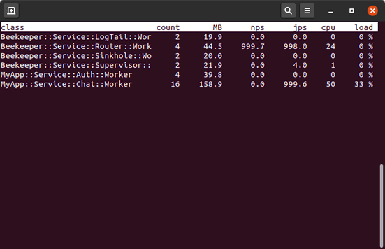

## Chat example

This example implements a real world setup with isolated buses and redundancy:


## Running this example

To run this example start worker pools:
```
cd beekeper/examples/chat
source setup.sh
./run.sh start
```
Then open `chat.html` in a browser, or use the command line client:

```
./chat.pl
```
The system can be stressed with:
```
./flood.pl -c 50 -r 500
```
When done, stop worker pools with:
```
./run.sh stop
```
Network traffic can be inspected with:
```
tcpflow -i any -C -g port 61613
```
This is `bkpr-top` showing this example running:




---
## RabbitMQ setup

This example uses the internal ToyBroker to allow being run out of the box, but to use `chat.html` the WebSockets capabilities of RabbitMQ are required (`chat.pl` works fine though).

To run this example using RabbitMQ set `use_toybroker` to false in config files, and configure RabbitMQ (enable STOMP and create the required users and virtual hosts) with the following commands:

```
rabbitmq-plugins enable rabbitmq_stomp
rabbitmq-plugins enable rabbitmq_web_stomp

rabbitmqctl add_user frontend abc123
rabbitmqctl add_user backend def456

rabbitmqctl add_vhost /frontend-A
rabbitmqctl add_vhost /frontend-B
rabbitmqctl add_vhost /backend-A
rabbitmqctl add_vhost /backend-B

rabbitmqctl set_permissions frontend -p /frontend-A ".*" ".*" ".*"
rabbitmqctl set_permissions frontend -p /frontend-B ".*" ".*" ".*"

rabbitmqctl set_permissions backend -p /backend-A  ".*" ".*" ".*"
rabbitmqctl set_permissions backend -p /backend-B  ".*" ".*" ".*"
rabbitmqctl set_permissions backend -p /frontend-A ".*" ".*" ".*"
rabbitmqctl set_permissions backend -p /frontend-B ".*" ".*" ".*"

rabbitmqctl set_policy expiry -p /backend-A  ".*" '{"expires":60000}' --apply-to queues
rabbitmqctl set_policy expiry -p /backend-B  ".*" '{"expires":60000}' --apply-to queues
rabbitmqctl set_policy expiry -p /frontend-A ".*" '{"expires":60000}' --apply-to queues
rabbitmqctl set_policy expiry -p /frontend-B ".*" '{"expires":60000}' --apply-to queues

rabbitmqctl set_topic_permissions frontend -p /frontend-A amq.topic "" "^msg.frontend.*"
rabbitmqctl set_topic_permissions frontend -p /frontend-B amq.topic "" "^msg.frontend.*"

#TODO: make /queue/req.backend write only for user frontend
```
Also ensure that `host` addresses in `bus.config.json` and `config.js` match RabbitMQ one.

**WARNING:** Permissions for user `frontend` must be heavily restricted in production enviroments!

---

This example uses the STOMP.js library Copyright 2010-2013 [Jeff Mesnil](http://jmesnil.net/), Copyright 2012 [FuseSource, Inc.](http://fusesource.com), Copyright 2017 [Deepak Kumar](https://www.kreatio.com).
Currently maintained at <https://github.com/stomp-js/stomp-websocket>.
